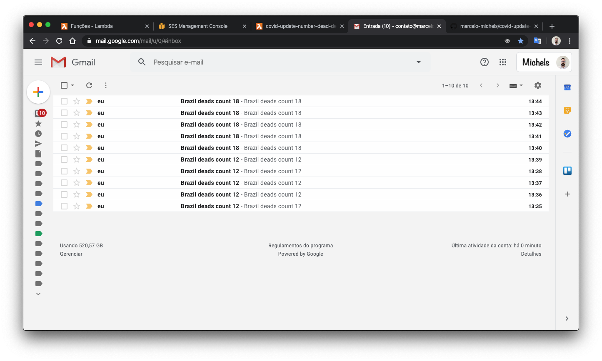
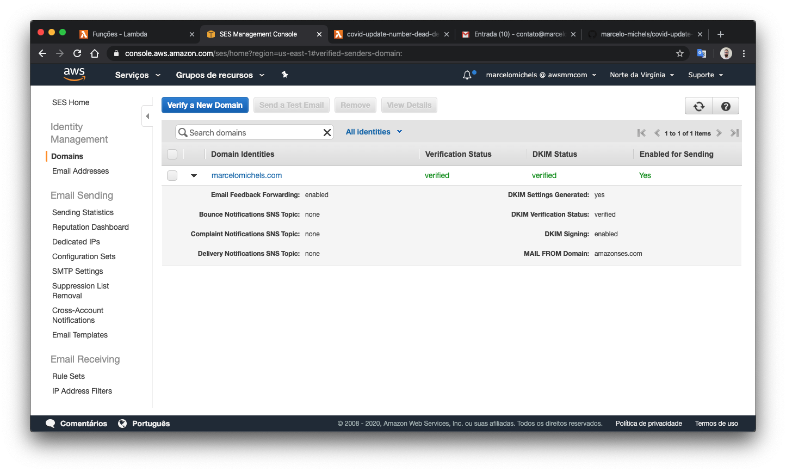

# covid-update-number-dead
- Função lambda que manda e-mail com total de mortos no Brasil para o meu e-mail a cada 30 minutos
- Assim passo a receber notificações push do e-mail com o numero de mortos por codiv-19 no Brasil

## Resultado

## Dependencias
`` npm i -g serverles ``  
`` npm install ``  

## Fazer deploy no AWS Lambda
`` serverles deploy``

## Configurar um dominio para o e-mail utilizado no AWS SES

